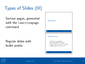
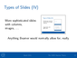
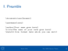
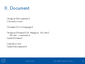

I found [Beamer](https://bitbucket.org/rivanvx/beamer) to be
rather popular at CERN and it's certainly the only decent way of
making slides  I've found in recent years (in all fairness, the
[Sozi](http://sozi.baierouge.fr)/[Inkscape](http://www.inkscape.org)
pair isn't bad at all either). So I thought I'd write
a Beamer theme following the official [CERN design
guidelines](http://design-guidelines.web.cern.ch/presentations).

# Documentation and Sample Presentation

[beamer-cern.pdf](beamer-cern.pdf):

# Installation

Copy the files to `~/.texmf`, `/usr/share/texlive/texmf-dist` (if you use
Tex Live), `/usr/share/texmf` or something similar.

# The CERN Logo

It's not provided here but there are official [CERN logos available for
download](https://design-guidelines.web.cern.ch/downloads).
Download the [*CERN logo
pack*](https://design-guidelines.web.cern.ch/sites/design-guidelines.web.cern.ch/files/downloads/CERN-LogoPack.zip).

A quick and dirty way to include a suitable logo is to copy the
`CERN-LogoPack/Outline/PNG/WHITE/LogoOutline-04.png` file to the directory
where your slides are. Rename it to `cern-logo.png`.

A cleaner way would involve using a vector graphics editor such as
[Inkscape](https://inkscape.org) and editing the `CERN-LogoPack/Outline/Format
PAO/LogoOutline.svg` file to turn the logo outline white. Then export it as a
PDF file to the directory where your slides are. Rename it to `cern-logo.pdf`.
